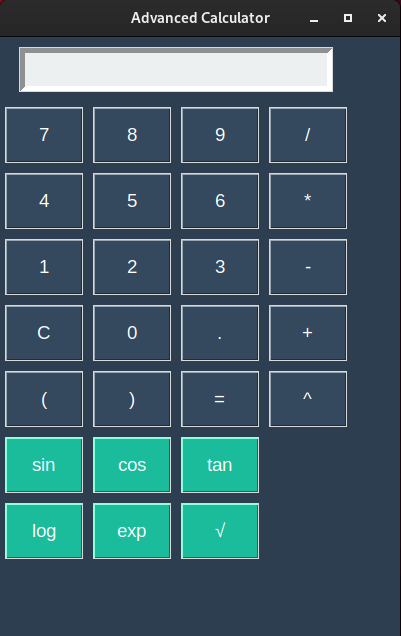

# Advanced Calculator GUI

This repository contains an advanced calculator with a graphical user interface (GUI) built using Python and Tkinter. The calculator supports basic arithmetic operations, scientific functions, and offers a clean, user-friendly design.

## Features

- **Basic Arithmetic Operations**:
  - Addition, subtraction, multiplication, division.
  - Supports parentheses for complex calculations.
- **Scientific Functions**:
  - Trigonometric functions: `sin`, `cos`, `tan`.
  - Logarithmic function: `log`.
  - Exponential function: `exp`.
  - Square root: `√`.
- **Modern Design**:
  - A clean interface with organized buttons.
  - Easy-to-read input and output fields.

## Preview



## Requirements

- Python 3.6 or higher
- Tkinter (included with most Python installations)

## Installation and Usage

1. Clone this repository:
   ```bash
   git clone https://github.com/josevbrito/AdvancedCalculatorGUI.git
   cd AdvancedCalculatorGUI
   ```

2. Run the application:
   ```bash
   python3 calculator.py
   ```

3. Use the calculator by clicking the buttons or typing into the input field. Supported functions include both basic and scientific operations.

## How It Works

- **Basic Operations**:
  - Enter numbers and operators directly into the input field or use the buttons.
  - Press `=` to compute the result.

- **Scientific Functions**:
  - Type or select a value, then use the corresponding function buttons (e.g., `sin`, `√`).

- **Error Handling**:
  - If an invalid operation is entered, the calculator displays "Error". Simply clear the field and try again.

## Customization

Feel free to customize the code to:
- Add more scientific functions.
- Adjust the colors, fonts, or button layout.
- Integrate with external libraries for extended functionality.

## Contributing

Contributions are welcome! If you have improvements or suggestions, please fork this repository and create a pull request.

## License

This project is licensed under the MIT License. See the [LICENSE](LICENSE) file for details.
